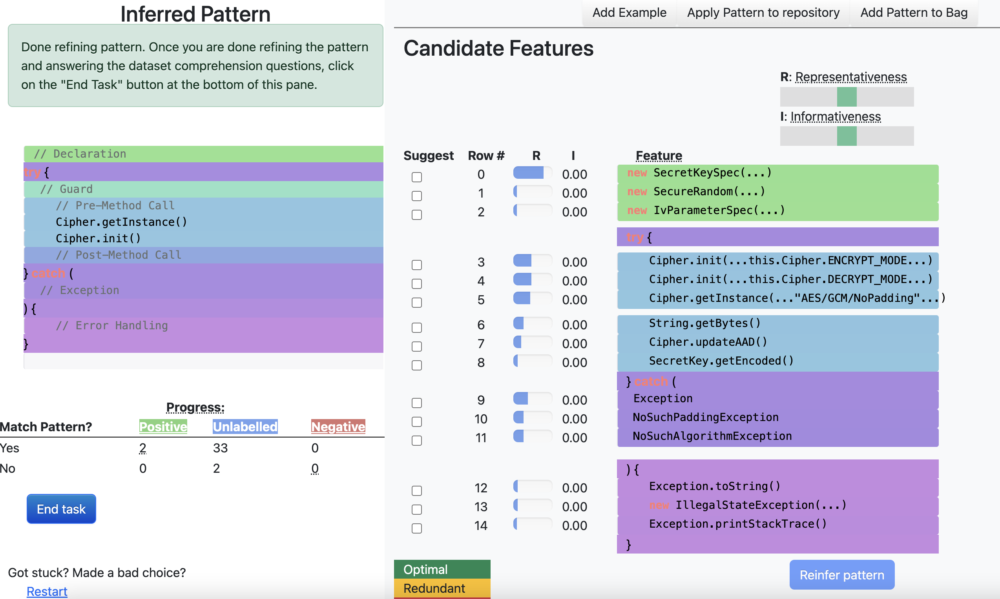
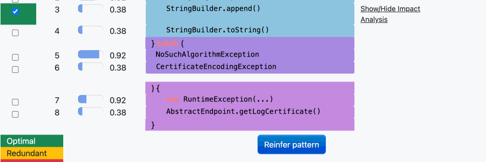
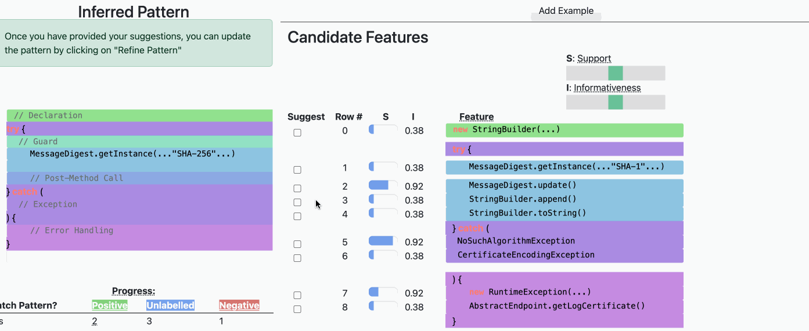
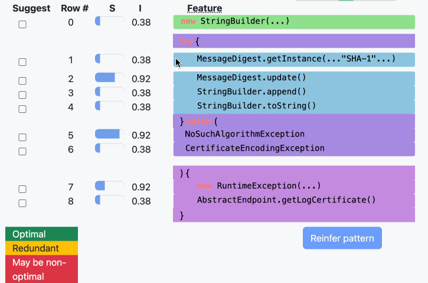

# SURF
Scaling Code Pattern Inference with Interactive What-If Analysis (ICSE 2024) 
(pdf[https://web.cs.ucla.edu/~miryung/Publications/icse2024-surf.pdf])

## Summary of SURF 

SURF is an approach for active learning for code pattern inference.

It reduces users’ labelling effort, incorporates direct feature-level feedback, and actively guides users in
assessing the implication of having a particular feature choice in the
constructed pattern.
The key insight behind SURF is that users can effectively select
appropriate features with the aid of impact/what-if analysis. 

SURF offers the following features:
1. SURF summarizes the population of usages into a skeleton, useful for understanding a large population of how an API is used. All features (e.g., Cipher.getInstance()) are overlaid with one another under a single code skeleton view. The features are structurally grouped, with each group distinguished from another by a different background color.

2. SURF provides hints on the global distribution, including  how each feature is consistent
with already labelled positive and negative instances. Each feature 
has support (S) - how many instances include the feature and information gain (I) — how well the feature  separates already labelled positive and negative instances. These scores guide a user to grasp the
distribution of individual features in the entire population

3.  Impact Analysis. Clicking on each feature shows
how the feature is distributed among already labelled
positive and negative instances, and would match additional instances in the population.

4. What-If Analysis. Users can contrast the
impact of two feature choices to understand how the pattern can
include (or exclude) more instances in the rest of the population.


The left side of the interface is where the inferred pattern will be displayed.
The right side shows the candidate features. 

## Running

### Alternative1: From docker
Run `docker run -p 3000:3000  -it codesurf/surf /bin/bash`

### Alternative2: install meteorjs locally
Install meteorjs and the dependencies of SURF (replace "MyUserName"):
```
npm install -g meteor 
export PATH=/Users/MyUserName/.meteor:$PATH

meteor npm install --save pycollections html2canvas bootstrap highlight.js @babel/runtime openai
```

Install Java, e.g., using brew
```
brew install java 
```

### Run a case study

From the command line in the meteor_app directory, run either one of the following three commands:
```
sh run_cipher.sh
```

```
sh run_digest.sh
```

```
sh run_random.sh
```

## Tutorial

Follow the tutorial in [study/surf_tutorial.pdf](study/surf_tutorial.pdf),

Use the docker image `codesurf/surf`
Run `docker run -p 3000:3000  -it codesurf/surf /bin/bash`
From code/meteor_app, run `sh run_digest.sh`
Go to localhost:3000.

The left side of the interface is where the inferred pattern will be displayed.
The right side shows the candidate features. 
Initially, both are empty.

Click on "predefined examples".


Scroll down and click on "Infer pattern". Now, a pattern will be inferred and be shown on the left side of the interface.

Both the inferred pattern and the candidate features are structurally grouped (with colors distinguishing the different groups). For example, code related to error and exception-handling are purple. Code related to constructors are in green. 
Each feature's support and information gain is displayed beside it.

To perform an impact analysis, click on a feature to expand it
.

From the impact analysis, you can inspect which instances will be included and excluded from the inclusion of a feature. 

To perform a what-if analysis, check the checkboxes of a pair of features. Then, click on "Why?"



From the what-if analysis, you can contrast the impact of a pair of features.

Finally, select the feature that you believe should be included, and click "Reinfer pattern".


## User study tasks

For the Cipher task, go to [taskA](taskA).

For the task on generating keys, go to [taskB](taskB).
